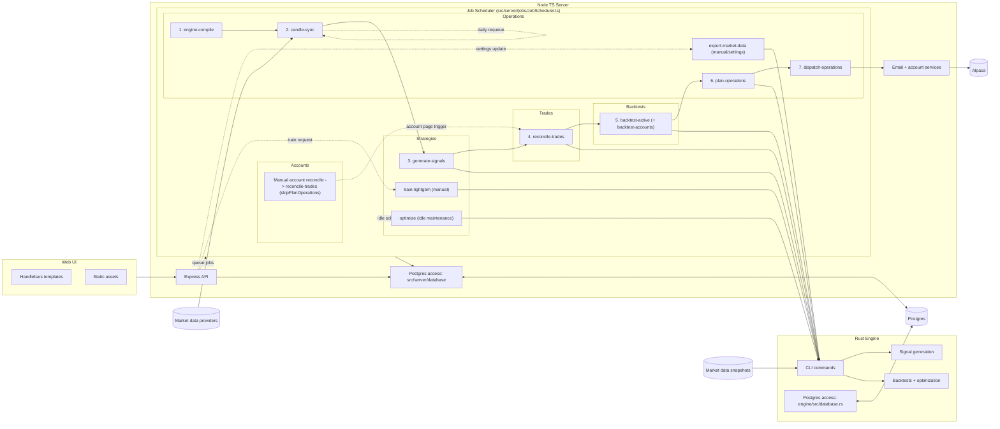

# Advanced topics

## Local setup

If you specifically want to run StratCraft on `localhost` for evaluation or development, use [LOCAL_SETUP.md](LOCAL_SETUP.md). The recommended main deployment path remains [scripts/DEPLOYMENT.md](scripts/DEPLOYMENT.md).

## Rust engine

NodeJS app compiles and calls engine automatically. See [engine/README.md](engine/README.md) for more info.

## Contributing

We currently do not accept pull requests. Please open a GitHub issue or discussion instead. For security vulnerabilities, see [SECURITY.md](SECURITY.md).

## LightGBM (optional)

StratCraft supports creating LightGBM-based strategies trained via Web UI, without modifying the code. You only need the **LightGBM CLI** if you want to train models (`engine train-lightgbm` or the `train-lightgbm` job in the web UI). Running/inferencing an already-trained model does not require the CLI.

Windows (localhost): the repo includes a prebuilt LightGBM CLI at `engine/vendor/lightgbm.exe` (with `engine/vendor/lib_lightgbm.dll`). `engine train-lightgbm` uses it automatically, so you typically do not need to install anything or modify `PATH`. If Windows blocks the executable or you see a missing-DLL error, ensure both files exist in `engine/vendor/` and are allowed to run.

## Adding strategies and customizing

Strategies have two pieces: a TypeScript-side **template** (UI/parameters) and a Rust-side **implementation** (signals/execution).

To add a new built-in strategy template:

- Add a new JSON template under `src/server/strategies/` (copy an existing one; pick a new `id`).
- Implement the matching Rust strategy in `engine/src/strategies/` and register it in `engine/src/strategy.rs` using the same template id.
- Run tests (and start in paper trading) before deploying anywhere near a live account.

If you want to modify StratCraft with Codex, work in your own private fork/repo and deploy from that fork.

## Bundled third-party software

This repository redistributes prebuilt LightGBM binaries for Windows under `engine/vendor/`. LightGBM is licensed under the MIT License; see [THIRD_PARTY_NOTICES.md](THIRD_PARTY_NOTICES.md) and [LICENSE-LightGBM-MIT.txt](LICENSE-LightGBM-MIT.txt).

## License

StratCraft is licensed under the MIT License. See [LICENSE](LICENSE). Third-party notices for vendored assets are documented in [THIRD_PARTY_NOTICES.md](THIRD_PARTY_NOTICES.md).

## Architecture diagram

