# Dataset Split, Optimization, and Scoring

This document explains how StratCraft tries to reduce overfitting while searching for strategy parameters. It is written as presentation material: each section can be lifted into slides or video chapters with minimal editing.

Defaults shown here come from `src/server/database/pg.sql` and can be changed in Settings.

## 1. Executive Summary

- StratCraft splits the problem in two directions: by ticker and by time.
- Optimization only sees the training ticker bucket inside the optimizer training window.
- Validation checks whether the same idea still works on a different ticker bucket.
- Verification checks whether top parameter sets still work in a later, unseen date window.
- Parameter scoring rewards quality, low drawdown, local stability, and low training-to-validation degradation.

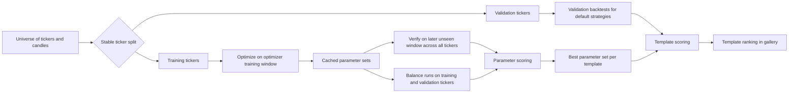

## 2. The Split Design

### 2.1 Ticker split: stable and deterministic

Training vs validation is a ticker-level split, not a random per-run shuffle.

- `SPY` and `QQQ` are forced into validation by default.
- Every other ticker is hashed from its uppercase symbol.
- If the hash value is below `TRAINING_ALLOCATION_RATIO`, the ticker goes to training.
- Otherwise it goes to validation.

That means the split is stable across runs: a ticker does not bounce between buckets just because we reran the job.

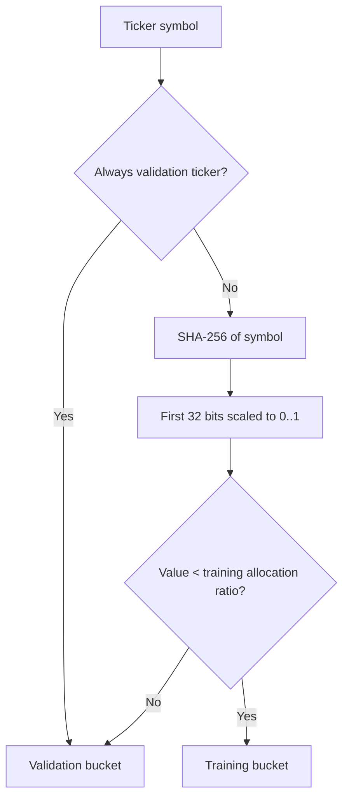

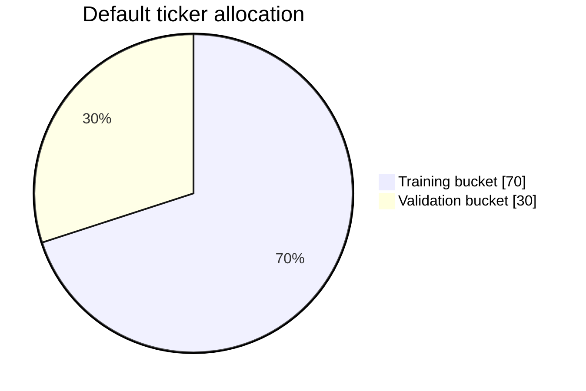

### 2.2 Time split: optimization window vs verification window

StratCraft also separates search time from forward-check time.

| Stage | Default scope | Default dates | Why it exists |
| --- | --- | --- | --- |
| Training | Training tickers only | `2021-01-01` to `2024-12-31` | Search for promising parameter sets without touching the future verify window |
| Validation | Validation tickers | Uses normal stored backtests across multiple periods | Check whether the idea transfers to a different ticker bucket |
| Verification | All tickers | `2025-01-01` to `2025-12-31` | Forward-style holdout that was not used during optimization |
| Balance | Training tickers and validation tickers, scored separately | `2023-01-01` to `2025-12-31` | Measure cross-bucket degradation on a later common window |

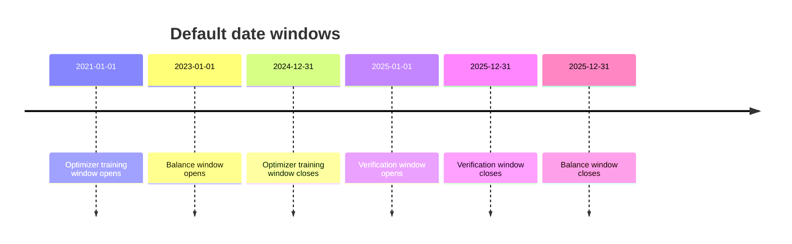

### 2.3 Why use both validation and verification?

- Validation is cross-sectional: "Does this idea survive on a different ticker bucket?"
- Verification is temporal: "Does this idea survive on later data?"
- Using both is stricter than using either one alone.

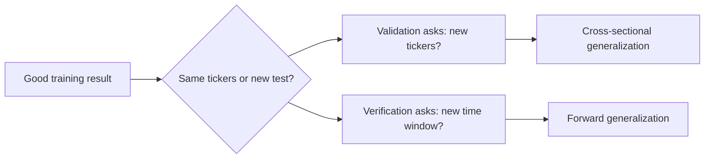

## 3. Optimization: How Parameter Search Works

Optimization is now coarse-to-fine search: deterministic multi-start exploration first, then local search refinement.

### 3.1 What gets optimized

- Only numeric template parameters with `min`, `max`, and `step` are auto-detected.
- Non-numeric parameters are ignored by the optimizer.
- `allowShortSelling` can be removed from the search if short-selling optimization is disabled.
- The optimizer keeps the best known parameter set if the API can provide one; otherwise it uses template defaults as the baseline seed.
- Around that baseline, it generates a deterministic batch of exploratory seeds across the allowed parameter grid before local refinement begins.

### 3.2 Search loop

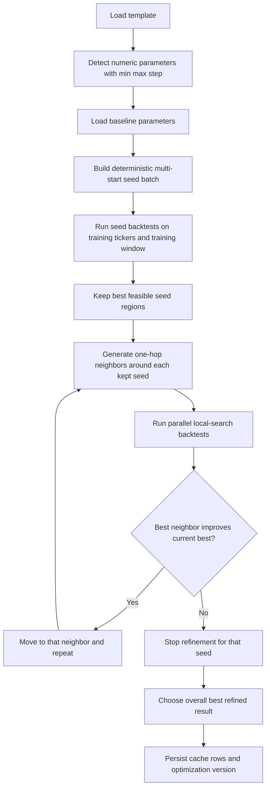

### 3.3 What "one-hop neighbors" means

For each parameter, StratCraft perturbs only one parameter at a time around the current point using configured step multipliers.

Default step multipliers:

```text
-4, -3, -2, -1, +1, +2, +3, +4
```

If a parameter has `step = 0.5`, the neighbor proposals are current value plus or minus `0.5`, `1.0`, `1.5`, and `2.0`, while still respecting min and max bounds.

The important difference now is that StratCraft does not rely on one starting point anymore. It first probes multiple seed locations, then applies the one-hop neighbor logic only to the strongest seed regions.

### 3.4 What objective wins

The optimizer keeps only candidates whose max drawdown stays under the configured ceiling.

Default hard risk gate:

```text
MAX_ALLOWED_DRAWDOWN_RATIO = 0.30
```

Default objective:

```text
OPTIMIZATION_OBJECTIVE = SHARPE
```

So the practical rule is:

```text
maximize Sharpe ratio
subject to max drawdown <= 30%
```

If the objective is changed, the same loop can instead maximize CAGR.

## 4. What Happens After Optimization

Optimization writes candidate rows into `backtest_cache`. Then the scheduler runs two more passes over those cached parameter sets:

1. `verify`
2. `balance`

The two passes answer different questions.

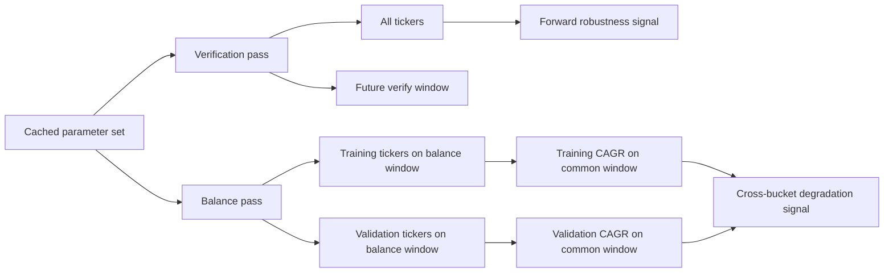

### 4.1 Verification

Verification reruns each unique cached parameter signature:

- on `VERIFY_WINDOW_START_DATE` to `VERIFY_WINDOW_END_DATE`
- across all tickers
- without reusing the optimization cache

This produces extra metrics such as:

- `verify_sharpe_ratio`
- `verify_calmar_ratio`
- `verify_cagr`
- `verify_max_drawdown_ratio`

### 4.2 Balance runs

Balance runs rerun each unique cached parameter signature twice:

- once on training tickers inside the balance window
- once on validation tickers inside the balance window

This produces paired metrics such as:

- `balance_training_cagr`
- `balance_validation_cagr`

Those two values are later used as an overfit penalty. If training CAGR is much higher than validation CAGR on the same later window, the score gets cut down.

## 5. Parameter Scoring: How One Cached Row Beats Another

Parameter scoring happens after cached rows already exist. It decides which parameter set should be treated as the best one for a template.

### 5.1 Eligibility gate

A row is excluded before scoring if it is missing key inputs or if it does not trade enough.

Default minimum:

```text
PARAM_SCORE_MIN_TRADES = 20
```

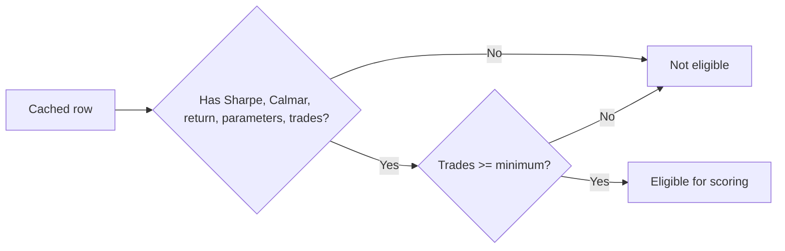

### 5.2 Score components

Each eligible row gets four major ingredients:

1. Core quality
2. Drawdown penalty
3. Stability score
4. Balance penalty

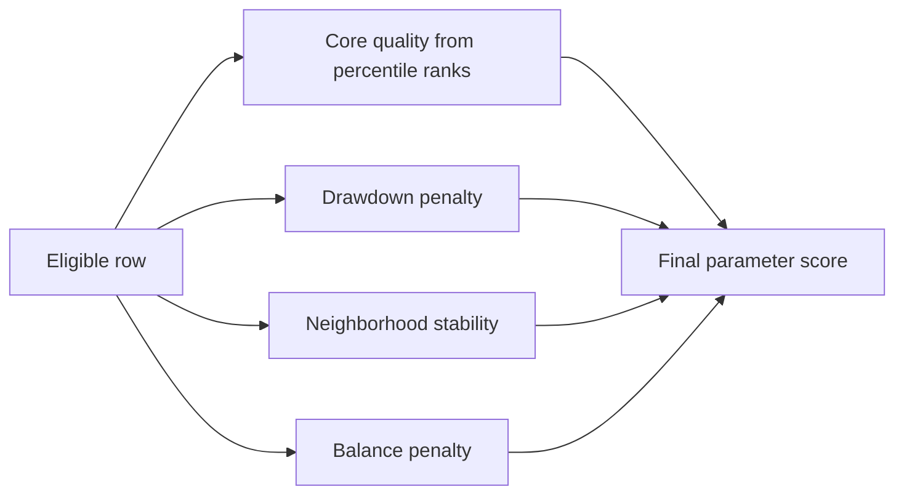

### 5.3 Core quality

The raw train metrics are converted into percentile ranks across the candidate pool:

- Sharpe percentile
- Calmar percentile
- Return percentile

Training core:

```text
coreTrain = cbrt(pSharpe * pCalmar * pReturn)
```

If verification metrics exist, they are converted into verify percentiles and blended with the training core:

```text
coreVerify = cbrt(pVerifySharpe * pVerifyCalmar * pVerifyReturnLike)
coreScore = sqrt(coreTrain * coreVerify)
```

This makes a parameter set stronger when it ranks well both in-sample and in the unseen verify window.

### 5.4 Drawdown penalty

Drawdown is penalized exponentially.

Default lambda:

```text
PARAM_SCORE_DRAWDOWN_LAMBDA = 3.5
```

Training-only form:

```text
ddPenalty = exp(-lambda * maxDrawdownRatio)
```

If verify drawdown exists, train and verify drawdown penalties are blended with a geometric mean.

### 5.5 Stability score

StratCraft does not only want a sharp spike in parameter space. It prefers plateaus.

The idea:

- normalize parameter distances using each parameter's observed spread
- find nearby neighbors
- measure the average quality of those neighbors
- normalize that neighborhood quality to `0..1`

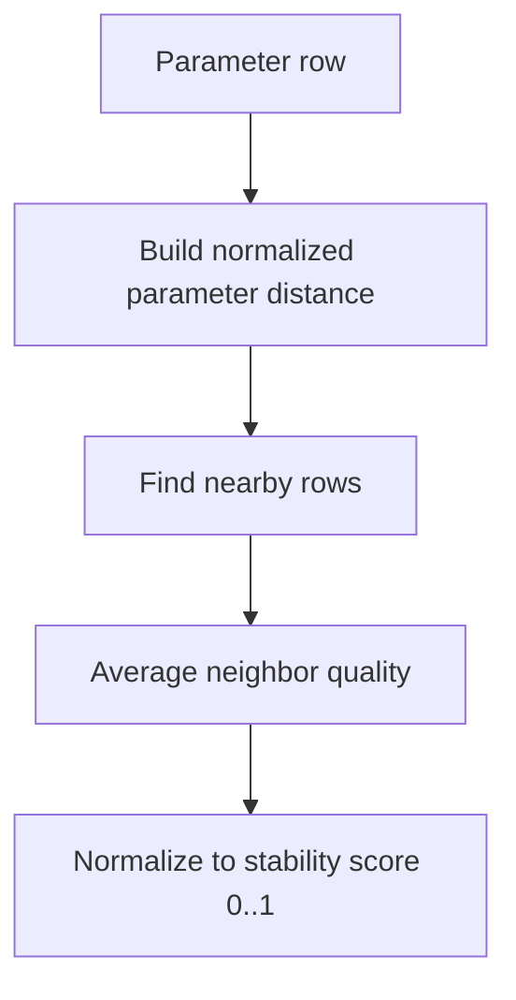

Default threshold:

```text
PARAM_SCORE_NEIGHBOR_THRESHOLD = 0.15
```

Implementation detail:

- If the candidate pool is small enough, stability uses exact pairwise comparisons.
- If the pool is large, it switches to bucketed neighbor lookup for speed.

### 5.6 Balance penalty

This is the direct anti-overfit penalty from the balance runs.

If training CAGR is much better than validation CAGR on the same balance window, the row is penalized.

```text
shortfall = max(0, trainingCagr - validationCagr)
denom = abs(trainingCagr) + abs(validationCagr)
basePenalty = clamp(1 - shortfall / denom, 0, 1)
balancePenalty = basePenalty^2
```

This is asymmetric on purpose: it punishes "great on training, weak on validation" harder than the reverse.

### 5.7 Final parameter score

The current final form is:

```text
finalScore =
  coreScore
  * ddPenalty
  * stabilityScore^2
  * balancePenalty
```

Key interpretation:

- High quality is not enough.
- High quality with bad drawdown is not enough.
- High quality on an isolated spike is not enough.
- High quality that collapses from training to validation is not enough.

## 6. Template Scoring: How Whole Strategy Families Are Ranked

Parameter scoring picks the best cached parameter row for a template. Template scoring answers a different question:

```text
How good is this template as a strategy family?
```

It uses stored default-strategy backtests across multiple periods, with separate training and validation results.

Default periods come from:

```text
BACKTEST_ACTIVE_MONTHS = 1,3,6,12,24,36,48,60,120
```

### 6.1 Period score

For each period where both training and validation results exist, StratCraft computes:

- return score from validation CAGR
- consistency score from training CAGR vs validation CAGR
- risk score from validation drawdown
- liquidity score from trades per year
- extra penalty if validation CAGR is negative

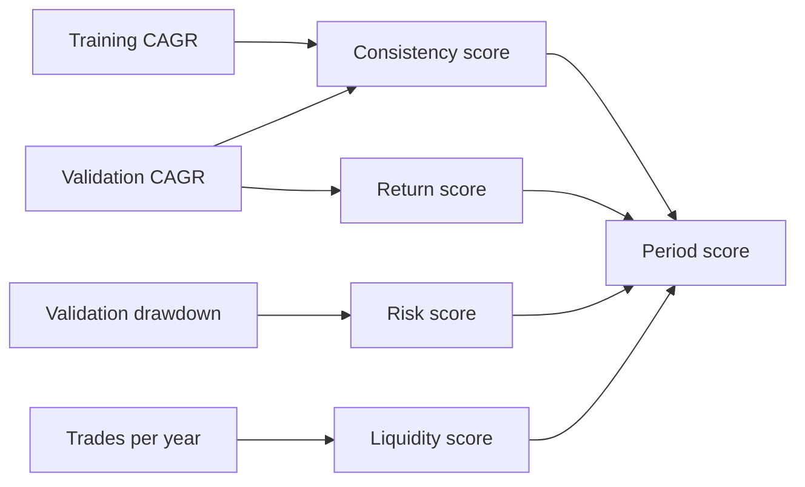

Compact form:

```text
periodScore =
  returnScore
  * consistencyScore
  * riskScore
  * liquidityScore
  * negativeValidationPenalty
```

### 6.2 Weighting across periods

Longer windows get more weight, and fresher results get more weight.

```text
weight = sqrt(periodMonths) * recencyWeight
```

So a stable 60-month result matters more than a 1-month result, but older data is gently discounted.

### 6.3 Verification multiplier

After the base template score is computed, verification metrics from the best cached parameter row can move the score up or down.

Default multiplier band:

```text
0.8x to 1.2x
```

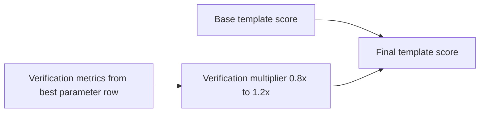

This is the final step that lets forward-style evidence influence the gallery ranking.

## 7. The Philosophy in One Sentence

StratCraft is trying to favor parameter regions that are:

- good in-sample
- still good on held-out tickers
- still acceptable on a later unseen window
- not dependent on a fragile one-point spike in parameter space

## 8. Presenter Notes

If this is turned into video content, the clean chapter order is:

1. Explain the two-axis split: ticker split plus time split.
2. Show why validation and verification are not the same thing.
3. Walk through the local search optimizer.
4. Show the post-search verify and balance passes.
5. Explain parameter scoring as "quality times robustness".
6. End with template scoring as the portfolio-level ranking layer.

## 9. Implementation Anchors

These are the main files behind the behavior described above:

- Ticker split: `src/server/jobs/handlers/candleSyncHandler.ts`
- Default settings: `src/server/database/pg.sql`
- Optimization command: `engine/src/commands/optimize.rs`
- Local search engine: `engine/src/optimizer.rs`
- Verification command: `engine/src/commands/verify.rs`
- Balance command: `engine/src/commands/balance.rs`
- Parameter scoring: `src/server/scoring/paramScore.ts`
- Template scoring: `src/server/scoring/templateScore.ts`

## 10. Current Implementation Note

The repository currently exposes a `PARAM_SCORE_CORE_SCORE_QUANTILE` setting in Settings, but the active scorer in `src/server/scoring/paramScore.ts` does not consume that value yet. The effective parameter-score controls today are the minimum-trade gate, drawdown penalty, neighborhood threshold, pairwise-neighbor limit, and the fixed stability exponent in code.
