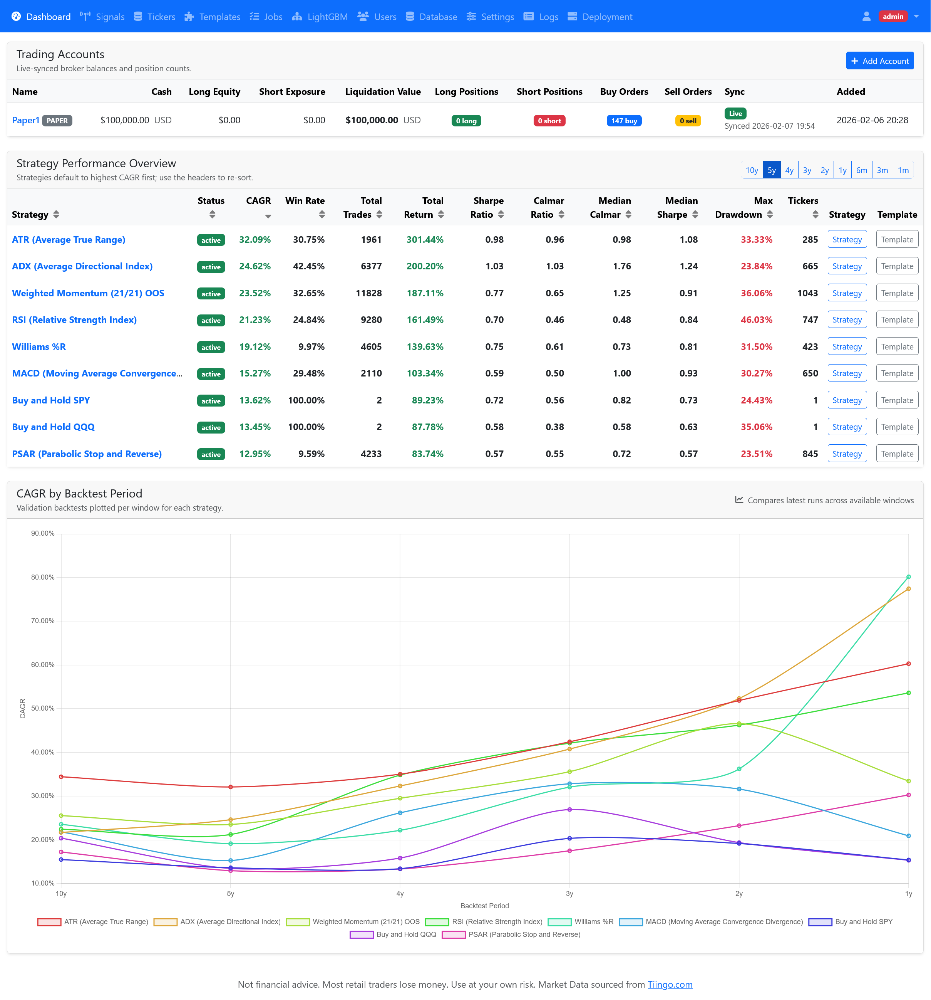
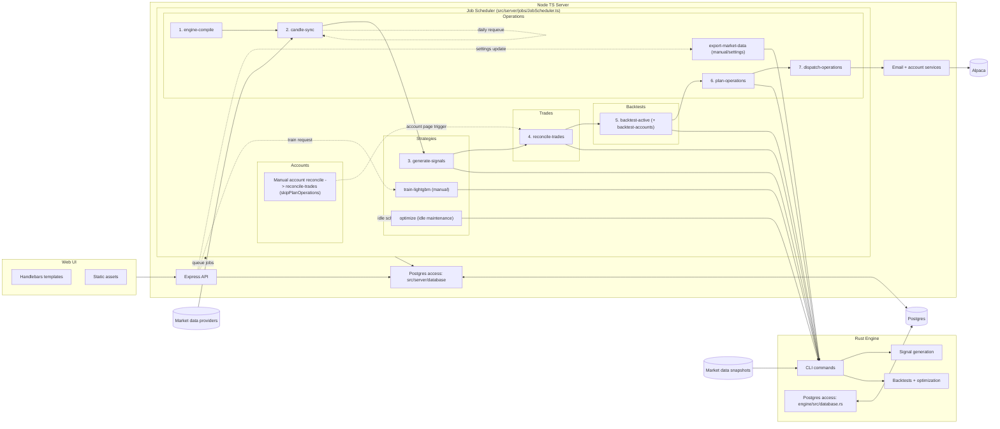

# StratCraft

StratCraft is a trading strategy backtesting, optimization and paper/live execution app. It is designed to trade the entire market of more than 10,000 instruments on [Alpaca](https://alpaca.markets/). The TypeScript/Node app provides the API, web UI and schedules jobs. The Rust engine runs the heavy optimization and backtesting workloads. Strategy optimization can run in parallel on multiple ad-hoc headless Hetzner machines.



## Disclaimer

StratCraft is not financial advice. Most retail traders lose money. Use at your own risk [DISCLAIMER.md](DISCLAIMER.md).

## Core ideas

These are working assumptions and observations that motivated the project (not guarantees):

- Over long horizons, holding mostly cash and nominal bonds can lose purchasing power after inflation
- Discretionary stock/crypto/metal picking and frequent trading tend to underperform for many retail investors
- Broad equities have historically outperformed high-quality bonds over long horizons (with higher volatility)
- Concentration risk (single country/sector/asset) is a major failure mode; diversification is preferred
- Public equities offer liquid proxies/tilts to many themes (commodities, real estate, crypto-related)
- Stock returns are highly skewed: many names underperform, few drive most of the gains
- For most retail participants, intraday edges are hard to sustain after spreads, slippage and fees
- Reduce human bias with backtests, out-of-sample validation, and automation

## Preliminary conclusions after optimizing dozens of strategies

These are empirical observations from my dataset, assumptions, and execution model; treat them as hypotheses.

- Complex strategies overfit easily: great performance in-sample, poor performance out-of-sample
- In backtests, beating QQQ appeared possible by diversifying over many independent outperformers (implementation-dependent)
- Trend-following that holds rising assets with wide stops over sufficient holding periods can outperform
- More stable strategies (high Sharpe) are typically easier to stick with than maximum-return ones (high CAGR)
- Equity markets tend to drift upward over time, and robust short strategies are hard to come by
- "Sell everything" logic during drawdowns did not outperform in my tests
- Filtering tickers by minimum volume did not outperform in my tests
- Selecting tickers where a strategy performed well in the past did not outperform in my tests
- Raising stops did not outperform in my tests

## Repo layout

- `engine/` Rust CLI engine for optimization, verification, signal generation, backtests, trade planning (see `engine/README.md`).
- `src/server/` Express server, API routes, jobs, services, and database access.
- `src/views/` Handlebars templates for the web UI.
- `src/public/` Static assets served by the web app.
- `src/shared/` Shared config and types between server modules.
- `data/` Market data snapshots used by the Rust engine.
- `scripts/` Build and helper scripts.
- `dist/` Compiled server output (generated).
- `target/` Rust build output (generated).

## Setup

Prereqs: Node.js + npm, Rust toolchain (for `engine`), and a Postgres instance.

From-zero (localhost):

1. Copy `.env.example` to `.env` and set at least `DATABASE_URL` and `DATABASE_KEY`.
2. Ensure Postgres is running and the role in `DATABASE_URL` exists. StratCraft will attempt to create the database named in `DATABASE_URL` on startup (requires DB create privileges); otherwise create the database manually.
3. Start the server:

```bash
npm install
npm start
```

4. Open `http://localhost:3000/` and request an access code for your email.
   - The first user becomes an admin.
   - If email delivery isn't configured yet, StratCraft will show the OTP in the UI for bootstrap login.
5. As an admin, configure a candle data provider in `Admin -> Settings` (Tiingo/EODHD/Alpaca). StratCraft needs candle data to backtest/optimize and generate signals.
   To support the project, consider using [Tiingo](https://www.tiingo.com/) as your candle source. Tiingo is an excellent daily candle provider and our partner.
6. Create a dedicated Alpaca paper account for loading the universe and enter provided keys in `Admin -> Settings -> Alpaca`
7. For email delivery, get a [Resend](https://resend.com/) API key, save it in `Admin -> Settings -> Email`, and add the 3 TXT DNS records for your sending domain exactly as instructed by Resend.

Server initializes the Postgres schema from `src/server/database/pg.sql` and builds the Rust engine from source on each start.

## Intended usage

Once you sign in as an admin and fill in all the missing `Settings`, restart the app and let it cook for half a day. It will:

- Load the trading universe from Alpaca
- Load daily candle history for 11 years from the candle provider
- Create default strategies from existing templates
- Backtest all strategies
- Start optimizing strategies. Once a strategy finishes optimizing, it will be deleted to be re-created on next app start with new parameters
- Once all strategies are optimized, it will verify out-of-sample
- Rank templates based on backtest performance, parameter stability and out-of-sample verification performance

To execute a strategy on a paper/live Alpaca account, add an account using the link on the dashboard and attach a strategy to it.

Every night the app will sync new candles a few hours after the market close, calculate strategy signals, update backtests, and enter/adjust/exit account trades. Account owner is notified by email once the trades are sent to the broker. There's plenty of time to cancel them if needed since they execute on market open.

## Running on Hetzner with world-wide access

StratCraft is primarily intended for personal/home use: run it on an always-on VPS (e.g. Hetzner) so your home PC does not need to stay on, heavy computations run in the cloud, and the web UI is reachable from mobile.

- Deploy to Hetzner and confirm HTTPS works ([scripts/DEPLOYMENT.md](scripts/DEPLOYMENT.md)).
- Enable **mTLS** and install provided client certificate on your desktop and mobile.
- Configure email delivery, set a recognizable **Site Name** and **Email Security Emoji** in `Admin -> Settings` (phishing mitigation).
- Connect an **Alpaca paper** account first, run it for a while, and only then add/link a live account.

## Security

StratCraft is a hobby/personal project, not a hardened multi-tenant service. Bugs and vulnerabilities are possible. Because this is an open-source codebase, an internet-exposed deployment can be easier to target; assume your instance will be scanned and probed.

- Use **mTLS** (client certificate), it can be enabled via `Admin -> Users -> Server Access Lockdown (Client Certificate)`.
- The Hetzner deploy script sets up HTTPS (Let's Encrypt), firewalling, fail2ban, basic security headers, rate limiting, and a manual update trigger (Admin -> Deployment); see `scripts/DEPLOYMENT.md`.
- Do not expose Postgres to the public internet; keep it bound to localhost or a private network.
- If you ever plan to restore the database, keep `DATABASE_KEY` backed up; it encrypts broker credentials and other secrets stored in Postgres.
- Treat email as an attack surface: verify the **Email Security Emoji** and **Site Name** on every StratCraft email subject before clicking links.
- Keep invite/session lifetimes reasonable (`Invite Link Valid Days`, `Session Cookie Valid Days`) and review the user list periodically.
- Avoid adding live Alpaca keys until they are actually needed.
- Change Alpaca live account keys if you notice unusual activity.

## Rust engine

NodeJS app compiles and calls engine automatically. See [engine/README.md](engine/README.md) for more info.

## Contributing

We currently do not accept pull requests. Please open a GitHub issue or discussion instead. For security vulnerabilities, see [SECURITY.md](SECURITY.md).

## LightGBM (optional)

StratCraft supports creating LightGBM-based strategies trained via Web UI, without modifying the code. You only need the **LightGBM CLI** if you want to train models (`engine train-lightgbm` or the `train-lightgbm` job in the web UI). Running/inferencing an already-trained model does not require the CLI.

Windows (localhost): the repo includes a prebuilt LightGBM CLI at `engine/vendor/lightgbm.exe` (with `engine/vendor/lib_lightgbm.dll`). `engine train-lightgbm` uses it automatically, so you typically do not need to install anything or modify `PATH`. If Windows blocks the executable or you see a missing-DLL error, ensure both files exist in `engine/vendor/` and are allowed to run.

## Adding strategies and customizing

Strategies have two pieces: a TypeScript-side **template** (UI/parameters) and a Rust-side **implementation** (signals/execution).

To add a new built-in strategy template:

- Add a new JSON template under `src/server/strategies/` (copy an existing one; pick a new `id`).
- Implement the matching Rust strategy in `engine/src/strategies/` and register it in `engine/src/strategy.rs` using the same template id.
- Run tests (and start in paper trading) before deploying anywhere near a live account.

If you want to modify StratCraft with Codex, work in your own private fork/repo and deploy from that fork.

## Bundled third-party software

This repository redistributes prebuilt LightGBM binaries for Windows under `engine/vendor/`. LightGBM is licensed under the MIT License; see [THIRD_PARTY_NOTICES.md](THIRD_PARTY_NOTICES.md) and [LICENSE-LightGBM-MIT.txt](LICENSE-LightGBM-MIT.txt).

## License

StratCraft is available for free personal use under the terms in [LICENSE](LICENSE).
Commercial use requires a separate commercial license; see [STRATCRAFT-COMMERCIAL.txt](STRATCRAFT-COMMERCIAL.txt).
Third-party notices for vendored assets are documented in [THIRD_PARTY_NOTICES.md](THIRD_PARTY_NOTICES.md).

## Architecture Diagram



## Integration Test Coverage

| Component | Integration Tests | Notes |
| --- | --- | --- |
| Engine Postgres-backed pipeline (signal generation + backtest + persistence) | `engine/tests/pipeline.rs::pipeline_smoke_small_dataset`, `engine/tests/pipeline.rs::full_pipeline_snapshot` | Exercises `AppContext`, `MarketData` loading, `generate_signals`, `backtest_active`, `backtester`, `engine`, `performance`, and `engine` DB persistence for signals/backtest results/trades. |
| Engine account backtests (account-linked strategies) | `engine/tests/pipeline.rs::backtest_accounts_smoke` | Exercises `backtest_accounts` command using account-linked strategies, signals, and persisted backtest results. |
| Engine market data snapshot export | `engine/tests/pipeline.rs::export_market_data_smoke` | Exercises `export_market_data` command and validates snapshot contents. |
| Engine local optimization (snapshot + DB updates) | `engine/tests/pipeline.rs::optimize_smoke` | Exercises `optimize` command with a minimal local-search configuration and validates template version + default strategy cleanup. |
| Engine operation planning (account operations) | `engine/tests/pipeline.rs::plan_operations_smoke` | Exercises `plan_operations` command with a stubbed Alpaca account state. |
| Engine trade reconciliation | `engine/tests/pipeline.rs::reconcile_trades_smoke` | Exercises `reconcile_trades` command with stubbed Alpaca order responses. |
| Engine backtest cache verification | `engine/tests/pipeline.rs::verify_smoke` | Exercises `verify` command and persists verification metrics. |
| Engine Postgres reads for backtest results | `engine/tests/pipeline.rs::pipeline_smoke_small_dataset`, `engine/tests/pipeline.rs::full_pipeline_snapshot` | Validates `load_latest_backtest_result` and stored snapshots/trades. |
| Engine snapshot file output (test snapshots under `engine/tests/snapshots*`) | `engine/tests/pipeline.rs::full_pipeline_snapshot` | Writes snapshot bundles for regression tracking. |

## Not Covered By Integration Tests Yet

| Component | Gaps |
| --- | --- |
| Server API endpoints + middleware (`src/server/`) | No integration tests; only unit tests present. |
| Server Postgres layer (`src/server/database/Database.ts`) | No integration tests of SQL reads/writes or migrations. |
| Job handlers (candle sync, backtest orchestration, plan/dispatch operations, reconciliation) | No integration tests for job flows or scheduling. |
| External integrations (Alpaca, EODHD, Resend email) | No integration tests; would require fakes or sandbox accounts. |
| Engine training command (`train-lightgbm`) | Not exercised by integration tests. |
| Live-trade backtest refresh (`backtest_active::update_live_backtests`) | Not exercised by integration tests. |
| UI rendering and static assets (`src/views`, `src/public`) | Not covered by integration tests. |

Note: This list focuses on integration tests only; unit tests exist but are not enumerated here. Snapshot bundles under `engine/tests/snapshots*` are generated from synthetic test data and do not contain third-party market data.
