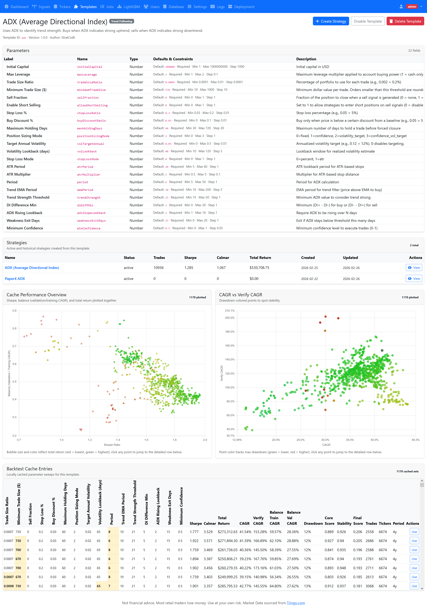

⚠️ **Warning: the default strategies here are biased to move in the same direction as the broader market and can lose money when the market goes down.**

# StratCraft

StratCraft is a trading strategy backtesting, optimization and paper/live execution app. It is designed to trade the entire market of more than 10,000 instruments on [Alpaca](https://alpaca.markets/). The TypeScript/Node app provides the API, web UI and schedules jobs. The Rust engine runs the heavy optimization and backtesting workloads. Strategy optimization can run in parallel on multiple ad-hoc headless Hetzner machines.

## Disclaimer

StratCraft is not financial advice. Most retail traders lose money. Use at your own risk [DISCLAIMER.md](DISCLAIMER.md).

## Core ideas

See [CORE_IDEAS.md](CORE_IDEAS.md) for core ideas and preliminary conclusions.

## User interface screenshots

<table>
  <tr>
    <td></td>
    <td></td>
    <td></td>
  </tr>
  <tr>
    <td></td>
    <td></td>
    <td></td>
  </tr>
  <tr>
    <td></td>
  </tr>
</table>

## Resources

- [YouTube channel](https://www.youtube.com/channel/UCQ0Y7yABbSCLoBIm7r1S8kQ/)
- [Telegram community](https://t.me/TeamOutOfSample)
- [Dataset Split, Optimization, and Scoring](DATASET.md)

## Recommended deployment

StratCraft is primarily intended to run as a full remote deployment on an always-on VPS, so your home PC does not need to stay on, heavy computations run in the cloud, and the web UI is reachable from desktop and mobile. The supported path in this repo is Hetzner.

- Deploy to Hetzner and confirm HTTPS works ([scripts/DEPLOYMENT.md](scripts/DEPLOYMENT.md)).
- Enable **mTLS** and install the provided client certificate on your desktop and mobile devices.
- Configure email delivery, then set a recognizable **Site Name** and **Email Security Emoji** in `Admin -> Settings`.
- Connect an **Alpaca paper** account first, let it run for a while, and only then add/link a live account.
- Once you sign in as an admin and fill in all missing `Settings`, restart the app and let it cook for half a day.

It will:

- Load the trading universe from Alpaca
- Load daily candle history for 11 years from the candle provider
- Create default strategies from existing templates
- Backtest all strategies
- Start optimizing strategies. Once a strategy finishes optimizing, it will be deleted to be re-created on next app start with new parameters
- Once all strategies are optimized, it will verify out-of-sample
- Rank templates based on backtest performance, parameter stability and out-of-sample verification performance

To execute a strategy on a paper/live Alpaca account, add an account using the link on the dashboard and attach a strategy to it.

Every night the app will sync new candles a few hours after the market close, calculate strategy signals, update backtests, and enter/adjust/exit account trades. Account owner is notified by email once the trades are sent to the broker. There's plenty of time to cancel them if needed since they execute on market open.

Localhost setup (secondary option for evaluation or development)

See [LOCAL_SETUP.md](LOCAL_SETUP.md).

## Security

StratCraft is a hobby/personal project, not a hardened multi-tenant service. Bugs and vulnerabilities are possible. Because this is an open-source codebase, an internet-exposed deployment can be easier to target; assume your instance will be scanned and probed.

- Use **mTLS** (client certificate), it can be enabled via `Admin -> Users -> Server Access Lockdown (Client Certificate)`.
- The Hetzner deploy script sets up HTTPS (Let's Encrypt), firewalling, fail2ban, basic security headers, rate limiting, and a manual update trigger (Admin -> Deployment); see `scripts/DEPLOYMENT.md`.
- Do not expose Postgres to the public internet; keep it bound to localhost or a private network.
- If you ever plan to restore the database, keep `DATABASE_KEY` backed up; it encrypts broker credentials and other secrets stored in Postgres.
- Treat email as an attack surface: verify the **Email Security Emoji** and **Site Name** on every StratCraft email subject before clicking links.
- Keep invite/session lifetimes reasonable (`Invite Link Valid Days`, `Session Cookie Valid Days`) and review the user list periodically.
- Avoid adding live Alpaca keys until they are actually needed.
- Change Alpaca live account keys if you notice unusual activity.

## Advanced topics

See [ADVANCED.md](ADVANCED.md) for engine details, LightGBM, customization, architecture, licensing, and contribution policy.
