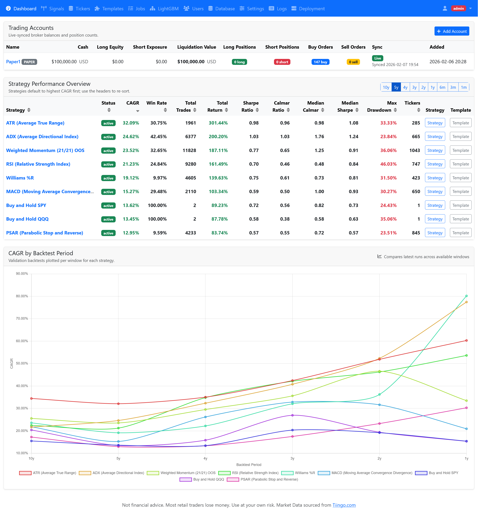
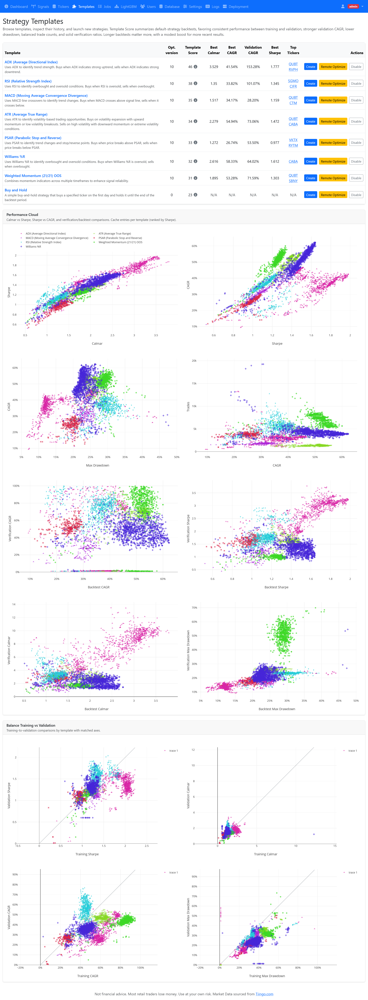
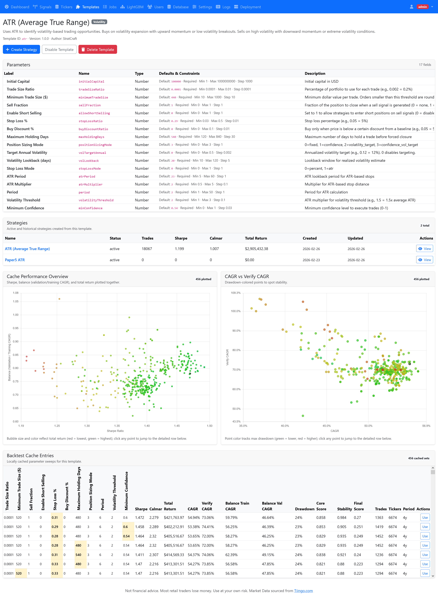
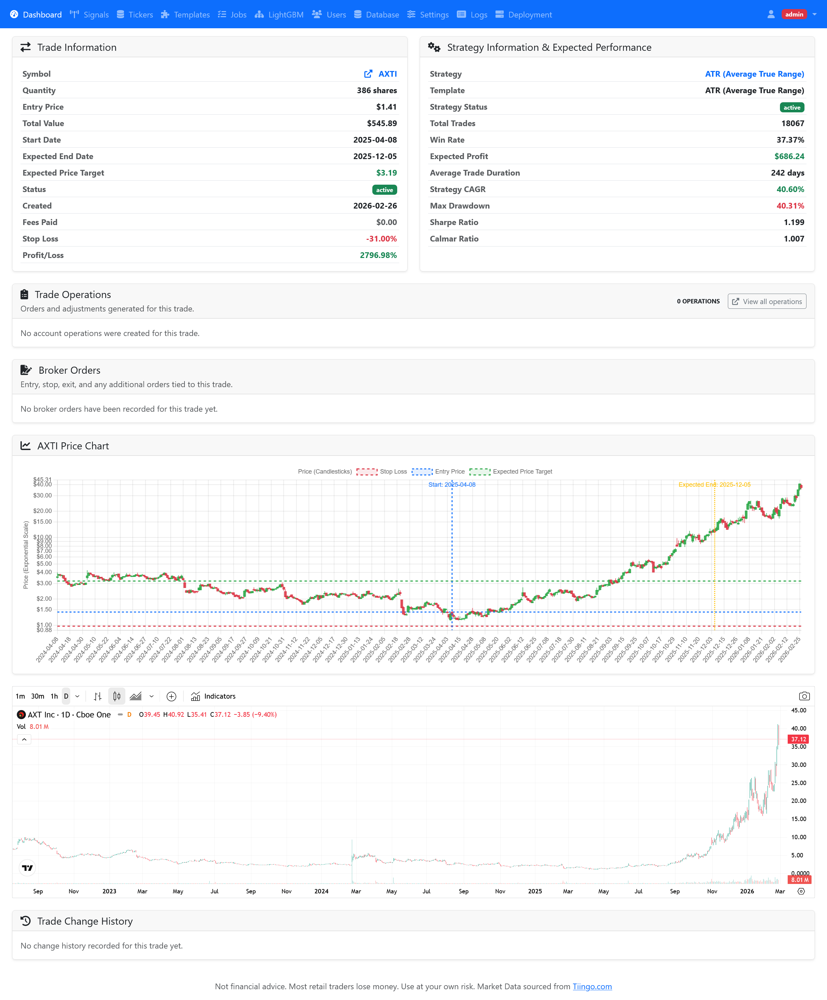
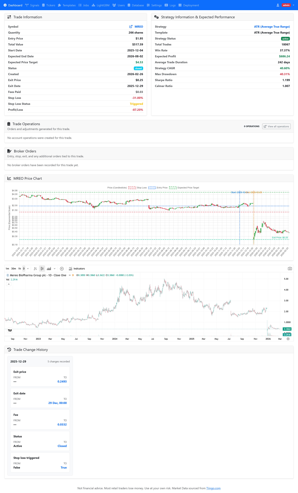

# StratCraft

StratCraft is a self-hosted web app for testing stock trading strategies on historical data, comparing different strategy settings, and optionally running those strategies on [Alpaca](https://alpaca.markets/) paper or live accounts.

In practical terms, it helps you answer questions like:

- "How would this strategy have behaved on past market data?"
- "Which settings look more stable, not just more profitable in one lucky test?"
- "Do I want to keep watching this in paper trading before I trust it with real money?"

It is designed around a broad Alpaca tradable universe of more than 10,000 instruments. It is software you run yourself, not a hosted service.

## Disclaimer

StratCraft is not financial advice. Most retail traders lose money. Use it at your own risk. Strategies in this repo are biased to move with the broader market and can lose money when the market goes down. Read [DISCLAIMER.md](DISCLAIMER.md).

## What can it do for me?

- Backtest strategy ideas on historical daily market data.
- Compare built-in strategy templates and many parameter combinations.
- Rank strategies by backtest results, parameter stability, and out-of-sample checks.
- Let you attach a strategy to an Alpaca paper account first, and later to a live account if you decide to take that risk.
- Keep working in the background after setup by refreshing data, recalculating signals, and planning broker actions.

## Who this is for / not for

**This may be a good fit if you:**

- want a systematic way to test trading ideas instead of trading by instinct
- are willing to self-host software on your own computer or a rented server

**This is probably not a good fit if you:**

- want a one-click product or hosted SaaS app
- want guaranteed results or trading signals you can trust without verification

## Before you start

You will need:

- a Hetzner Cloud server and domain name for the recommended deployment path, or a computer you control for advanced local setup
- an Alpaca account, ideally with a separate **paper trading** account first (simulated money)
- a daily market data provider for historical price history, such as Tiingo, EODHD, or Alpaca
- patience for the first full initialization, which can take hours

Helpful expectations:

- The documented main deployment path in this repo is Hetzner.
- You will also need a [Resend](https://resend.com/) API key and the ability to add the required DNS records (domain settings) for your sending domain.

## Recommended quickstart

If your goal is "run StratCraft the way this repo is designed to be run," use this order:

1. Follow [scripts/DEPLOYMENT.md](scripts/DEPLOYMENT.md) and deploy StratCraft to a Hetzner server with HTTPS.
2. Open `https://your-domain/`, request an access code, and sign in. The first user becomes an admin.
3. Configure a candle data provider in `Admin -> Settings`.
4. Configure email delivery in `Admin -> Settings -> Email` so OTP and notifications work normally.
5. Add only an **Alpaca paper** account. Do not add live API keys yet.
6. Fill in the missing admin settings, restart the app, and wait for the first full initialization to finish.
7. Enable `Admin -> Users -> Server Access Lockdown (Client Certificate)` and install the generated client certificate on each device you use.
8. Review the dashboard, template pages, strategy pages, and nightly updates for at least a few cycles.
9. Only consider live trading after paper trading long enough to understand the system, the results, and the risks.

If you specifically want `localhost` for evaluation or development, treat [LOCAL_SETUP.md](LOCAL_SETUP.md) as an advanced side path, not the default deployment route.

## What happens on first startup?

After the required settings are filled in, the first serious startup can take a long time. On a fresh setup, StratCraft may:

- load the tradable universe from Alpaca
- download about 11 years of daily **candles** (open, high, low, close, and volume bars) from your chosen data provider
- create default strategies from the built-in templates
- backtest those strategies on historical data
- optimize parameters by trying many combinations
- verify the results **out-of-sample**, meaning on historical data that was not used during tuning
- rank templates based on backtest performance, parameter stability, and out-of-sample verification

Realistic expectations:

- This will take days.
- Some pages may look sparse, unfinished, or change while background work is still running.
- During early setup, strategy entries can be recreated as the app refreshes template-derived strategies.

## What happens after setup?

Once initialized, StratCraft keeps working in the background.

- To make StratCraft trade a paper or live account, add that account from the dashboard and attach a strategy to it.
- A few hours after market close, it syncs new candles and recalculates signals.
- It updates backtests with the latest data.
- For linked Alpaca paper or live accounts, it plans and sends entry, adjust, or exit orders.
- It emails the account owner after orders are sent to the broker.
- Those trades are intended for market open, which usually leaves time to review and cancel them if needed.

## Hetzner deployment vs local setup vs live trading

| Path | Best for | What you need | Main tradeoffs |
| --- | --- | --- | --- |
| Hetzner deployment | Recommended main path | A Hetzner server, domain, HTTPS, email setup, Alpaca paper, market data provider | More setup upfront, but matches the intended always-on operating mode and works well across desktop and mobile |
| Advanced local setup | Evaluation or development on one machine | Your own computer, local prerequisites, Alpaca paper, market data provider | Useful for localhost evaluation or development, but not always on and not the main documented route |
| Live trading | Real broker execution | A proven paper-trading workflow, operational discipline, and live Alpaca keys | Highest risk. Software bugs, market losses, bad settings, and outages can cost real money |

Recommended order: Hetzner deployment -> paper trading -> live trading only if you still want it and understand the risk. Use local setup only if you explicitly want localhost evaluation or development.

## Screenshots

### Dashboard

The dashboard is the main overview page. It shows linked accounts, a ranked strategy summary, and longer-period performance charts so you can quickly see which strategies are active and how they behaved across different backtest windows.

### Templates overview

The templates page compares built-in strategy families. The scatter plots help you see tradeoffs such as return vs drawdown, Sharpe vs total return, and stability vs risk across many cached backtest results.

### Template detail

A template page lists the adjustable parameters for one strategy family and shows cached backtest results for many parameter combinations. This is where you compare settings instead of trusting a single "best" run.

### Strategy detail

A strategy page shows one configured strategy in depth: equity curve versus benchmarks, drawdowns, rolling performance, yearly summaries, and trade-level tables.

### Trade drill-downs

Winning trade example:

Losing trade example:

Trade pages let you inspect one trade at a time, including entry date, stop loss, expected exit, and the surrounding price chart. They are useful for understanding how a strategy behaves in both good and bad outcomes.

## Security

StratCraft is a hobby/personal project, not a hardened multi-tenant service. If you expose it to the internet, assume it will be scanned and probed.

Important guidance:

- Use HTTPS and enable **mTLS** if the app is reachable from the public internet. Here, mTLS means browsers or devices must present a client certificate before they can even reach the app. See [scripts/DEPLOYMENT.md](scripts/DEPLOYMENT.md).
- The Hetzner deploy script sets up HTTPS, firewalling, fail2ban, basic security headers, rate limiting, and a manual update trigger. See [scripts/DEPLOYMENT.md](scripts/DEPLOYMENT.md).
- Install the generated client certificate on each device you use before enabling `Admin -> Users -> Server Access Lockdown (Client Certificate)`.
- Do not expose Postgres to the public internet.
- Back up `DATABASE_KEY`. It is needed to decrypt stored broker credentials and other encrypted secrets in Postgres.
- Configure email delivery, then set a recognizable **Site Name** and **Email Security Emoji** in `Admin -> Settings`.
- Treat email as an attack surface. Verify the Site Name and Email Security Emoji on every StratCraft email before clicking links.
- Keep invite and session lifetimes reasonable, and review the user list periodically.
- Avoid adding live Alpaca keys until you actually need them.
- If you notice unusual activity on a live Alpaca account, rotate those keys immediately.

## Risks and limits

- Backtests can be misleading. A strategy that looked good on past data can fail badly in the future.
- Default strategies in this repo are biased toward broader market upside and can perform poorly in falling markets.
- Optimization can overfit. That is why out-of-sample verification matters, but it still does not guarantee future performance.
- Paper trading is safer than live trading, but it still does not fully match live fills, slippage, outages, or human mistakes.
- Bugs, bad data, provider outages, broker issues, or wrong settings can lead to unwanted trades or missing trades.
- This project assumes you are willing to monitor it, read its emails, and stop using live trading if behavior looks wrong.

## Glossary

- **Backtest**: a simulation of how a strategy would have behaved on past market data.
- **Paper trading**: sending simulated broker orders without risking real money.
- **Live trading**: sending real broker orders with real money.
- **Optimization**: trying many parameter combinations to find promising settings.
- **Out-of-sample**: testing on historical data that was not used during tuning, to reduce false confidence.
- **Candle**: a price bar for one period. In StratCraft, this usually means daily open, high, low, close, and volume data.
- **Template**: a strategy family with adjustable parameters, from which individual strategies are created.
- **VPS**: a virtual private server, meaning a rented always-on cloud machine.
- **mTLS**: mutual TLS, a client certificate requirement that blocks unknown browsers or devices before they reach the app.

## Where to go next

Start here:

- this README
- [scripts/DEPLOYMENT.md](scripts/DEPLOYMENT.md) for the recommended Hetzner deployment path with HTTPS
- [CORE_IDEAS.md](CORE_IDEAS.md) for the project's working assumptions and observations
- [ADVANCED.md](ADVANCED.md) for advanced local setup, engine details, LightGBM, customization, architecture, licensing, and contribution policy

Related references:

- [LOCAL_SETUP.md](LOCAL_SETUP.md) for advanced localhost setup for evaluation or development
- [DATASET.md](DATASET.md) for dataset split, optimization, and scoring details
- [DISCLAIMER.md](DISCLAIMER.md) for the full risk disclaimer
- [SECURITY.md](SECURITY.md) for vulnerability reporting
- [YouTube channel](https://www.youtube.com/channel/UCQ0Y7yABbSCLoBIm7r1S8kQ/)
- [Telegram community](https://t.me/TeamOutOfSample)
